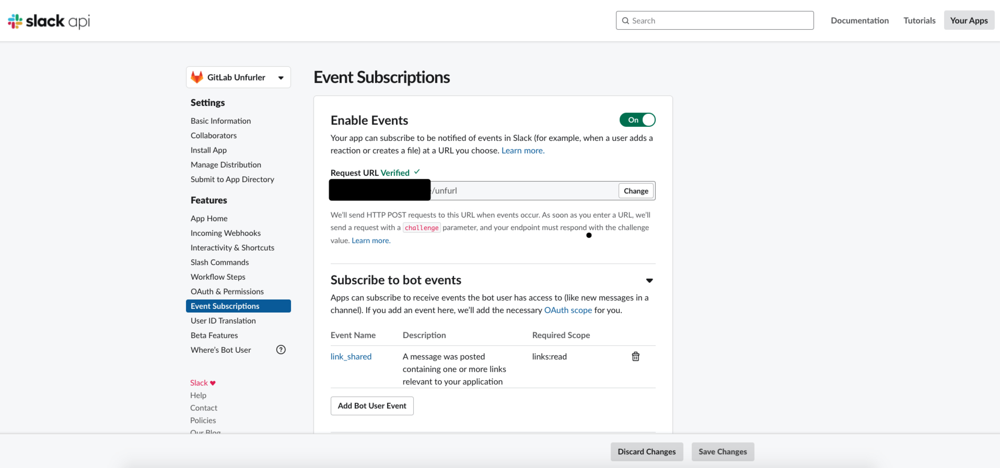

# Slack GitLab Unfurler
A server to unfurl GitLab links from Slack.

## What is unfurl?
Unfurling is the term Slack uses for displaying crawled data from a link under the message.

## When to use this server?
I created this server because Slack couldn't unfurl links from private GitLab repositories. For example when me and my team sends links to merge requests, we would just see the Sign In page as the unfurled data. With this solution, it will render information about the merge request.

# How to use it
## Gitlab token
Genereate a personal access token from your Gitlab account.

## Slack bot setup
First of all you'll need to create a Slack bot and install it on a Workspace. Obtain the Bot User OAuth Access Token.
Make sure to set the **Bot Token Scopes** to `links:read` and `links:write`.


Go to Event Subscriptions and enable it, then enter the request URL. The url should be something like: `http(s)://<your-domain>/unfurl`. The important part is the `/unfurl` path. This is where all events and Slack's challenge request ends up. **This will not work unless server is started. See [Start the server](#start-the-server)
**
Scroll down to **Subscribe to events on behalf of users** and add the scope `link_shared`.
Finally, on the same page, under **App unfurl domains** add the domains the events should happen on. E.g `gitlab.com`.

## Environment variables
```shell
GITLAB_TOKEN
GITLAB_GRAPHQL_URL - E.g https://gitlab.com/api/graphql
SLACK_OAUTH_TOKEN
PORT - What port the server should run on.
```

## Start the server
The server can be most easily started by running the Docker image.
```shell
docker run -d -p 5000:5000 \
-e GITLAB_TOKEN=<your token> \
-e GITLAB_GRAPHQL_URL=<url to your gitlab graphql endpoint>
-e SLACK_OAUTH_TOKEN=<slack bot oauth token> \
-e PORT=5000 \
marcusthelin/slack-gitlab-unfurler:latest
```

# Supported unfurls
Right now only merge request unfurling is supported, but this is an open source project so feel free to fork the repo and add other unfurls yourself.
